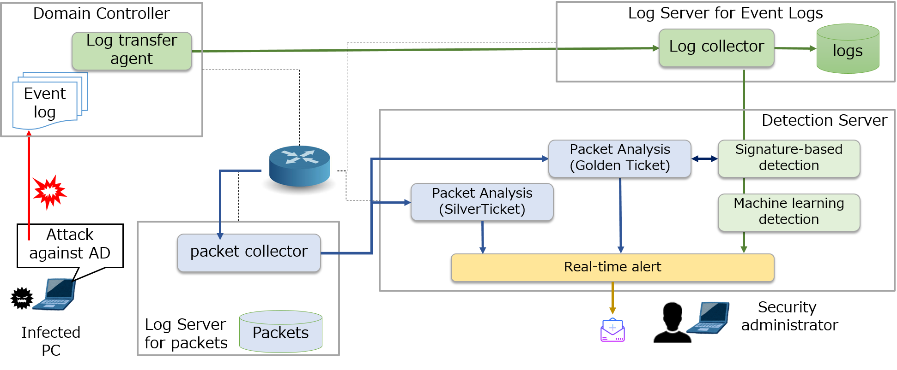

# Real-time detection tool of attacks leveraging Domain Administrator privilege

This is a real-time detection tool for detecting attack against Active Directory leveraging Domain Administrator privileges using Domain Controller Event logs.
Our tool can useful for immediate incident response for targeted attacks.

Our tool consists of the following steps to reduce false detection rate and support immediate incident response.
* Step1 (Signature based detection): Analyze  logs using several signatures focusing on the characteristics of the attack activities.
* Step2 (Machine Learning): Analyze logs with unsupervised machine learning in order to detect unusual command execution. 
* Step3 (Real-time alert): Raise real-time alerts using Elastic Stack if attack activities are detected.

<a href="Arsenal_eu-18-Real-time-Detection-of-Attacks-Leveraging-Domain-Administrator-Privilege.pdf" target="_blank">Documentation of the tool is here</a>

## Tool detail
###	Function of the tool
Our tool consists of the following components:
* Detection Server: Detects attack activities leveraging Domain Administrator privileges using signature based detection and Machine Learning.  Detection programs are implemented by Web API.
* Log Server:  Log Server is implemented using Elactic Stack. It collects the Domain Controller’s Event logs in real-time and provide log search and visualization.

1.	If someone access to the Domain Controller including attacks, activities are recorded in the Event log.
2.	Each Event Log is sent to Logstash  in real-time by Winlogbeat. 
Logstash extracts input data from the Event log, then call the detection API on Detection Server.
3.	Detection API is launched. Firstly, analyze the log with signature detection.
4.	Next analyze the log with machine learning.
5.	If attack is detected, judge the log is recorded by attack activities. 
Send alert E-mail to the security administrator, and add a flag indicates attack to the log .
6.	Transfer the log to Elasticsearch . 

###	Input of the tools: Event logs of the Domain Controller. 
* 4672: An account assigned with special privileges logged on.
* 4674: An operation was attempted on a privileged object
* 4688: A new process was created
* 4768: A Kerberos authentication ticket (TGT) was requested
* 4769: A Kerberos service ticket was requested
* 5140: A network share object was accessed

###	Output (result) of the tool
* Distinguish logs recorded by attack activities from logs recorded by normal operations, and identity infected computers and accounts.  
The detection result can be checked using Kibana.
* If attacks are detected, send email alerts to the specific E-mail address.

###	System Requirements
We tested our tool in the following environment.

* Domain Controller (Windows 2008R2)
    * Winlogbeat(5.4.2): Open-source log analysis platform
* Log Server: Open-source tools + Logstash pipeline
     * OS: CentOS 7
    * Logstash(6.5.0): Parse logs, launch the detection program, transfer logs to Elastic Search
    * Elastic Search(6.5.0): Collects logs and provides API interface for log detection
    * Kibana(6.5.0): Visualizes the detection results
* Detection Server: Custom detection programs
     * OS: CentOS 7
     * Python: 3.6.0
     * Flask: 0.12
     * scikit-learn: 0.19.1
     

###	How to implement
<a href="implementation.md">See implementation method</a>

  
